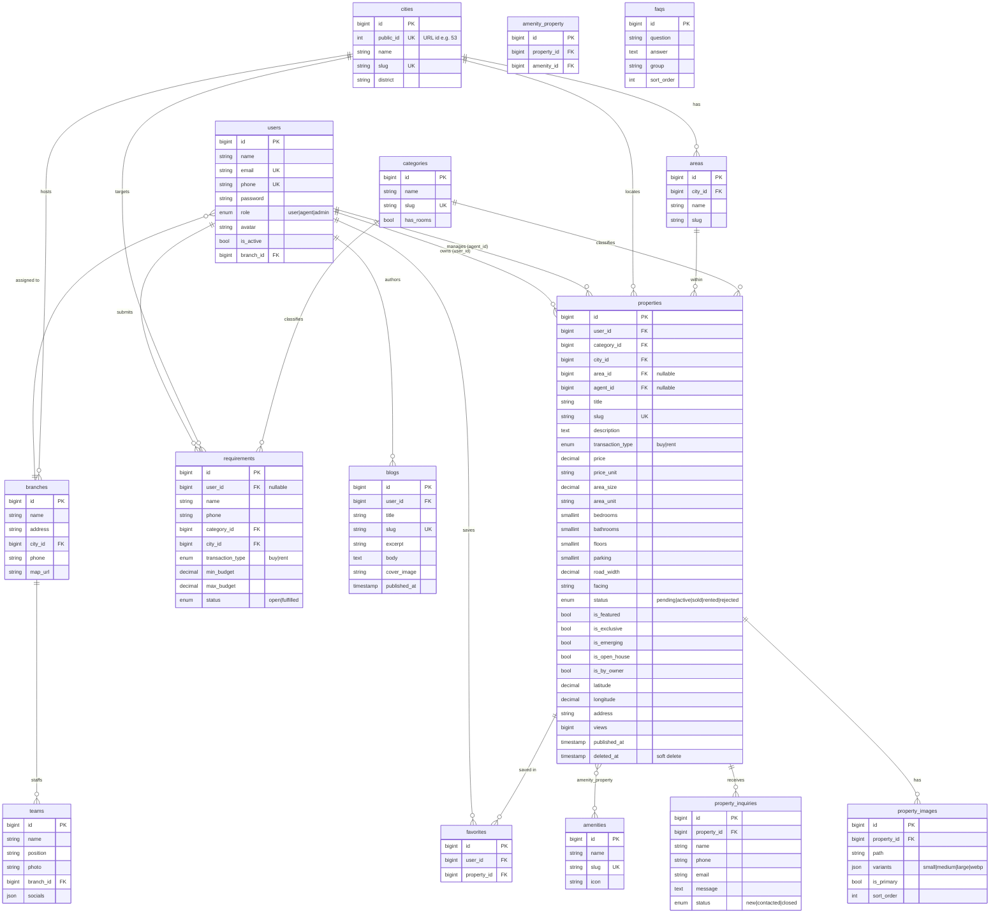

# Aakash Realtor — Entity Relationship Diagram

## Lifecycle notes

- **Property moderation:** `pending → active` (admin approves) → `sold` / `rented`,
  or `rejected`. Only `active` listings are returned to the public API.
- **Homepage placement** is driven by the boolean flags
  (`is_featured`, `is_exclusive`, `is_emerging`, `is_open_house`, `is_by_owner`),
  toggled by admins in Filament.
- **Requirement matching:** when a property becomes `active`, a queued job
  (`MatchRequirementsToProperty`) pairs it against `open` requirements sharing
  `transaction_type` + `category_id` + `city_id` with price inside the budget band.
